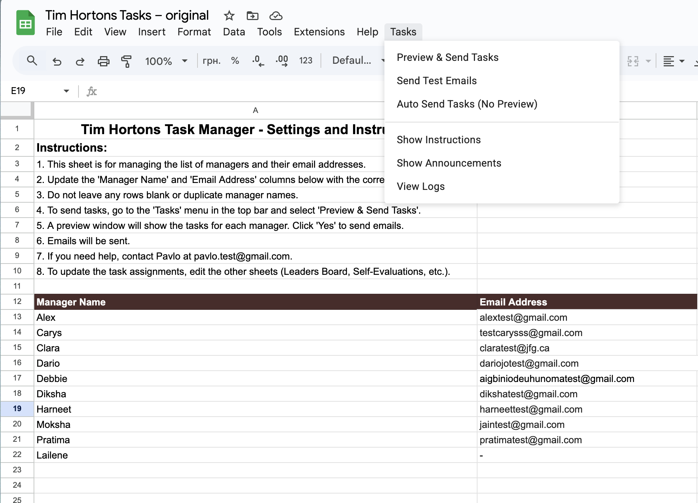
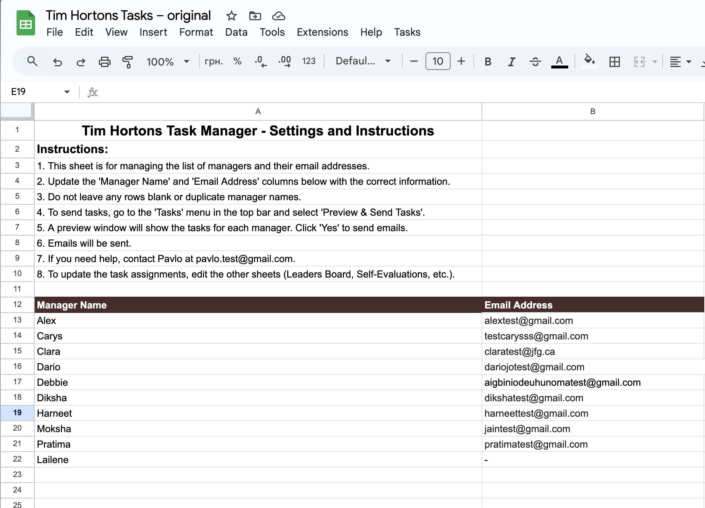
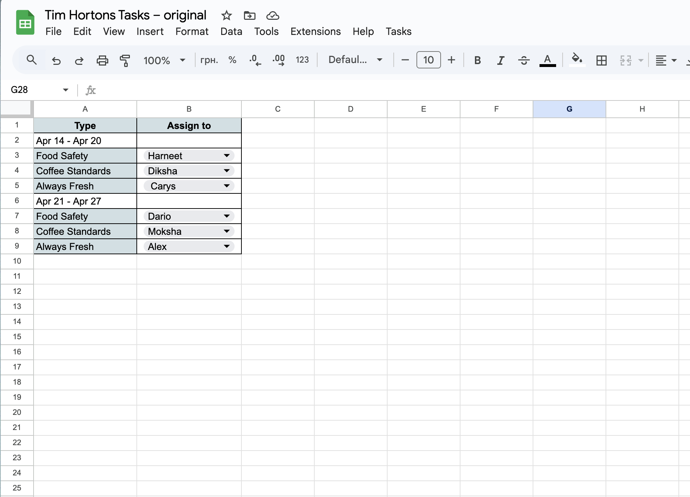
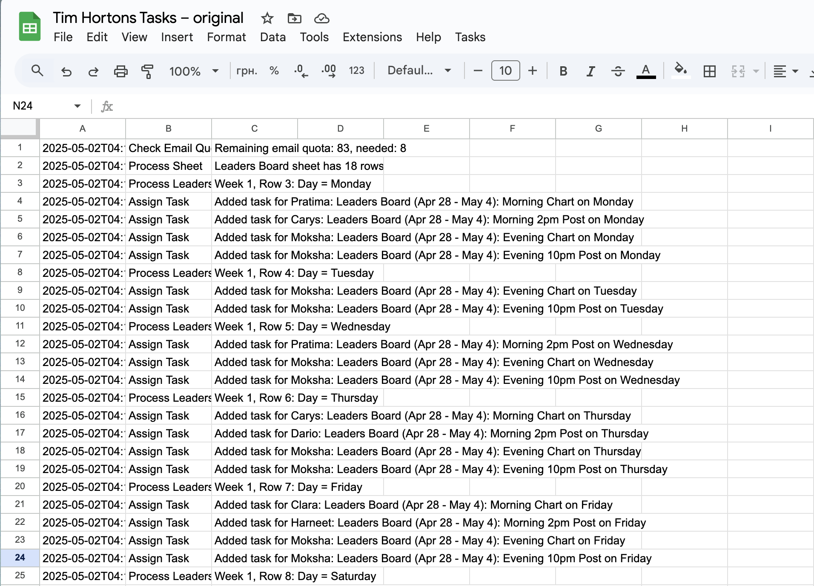

# Tim Hortons Weekly Task Automator

Google Apps Script tool that **automatically collects tasks** from multiple Google Sheets tabs and **sends personalized, beautifully formatted HTML emails** to restaurant managers every week.

**Real-world production tool** used at Tim Hortons restaurants in Winnipeg — reduces weekly manual preparation from 3–6 hours to ~2–3 minutes, eliminates distribution errors, and provides managers with clean, branded, calendar-style task overviews.

  

## Key Features

- Aggregates tasks from 10+ dedicated sheets:
  - Leaders Board (shift planning with visual calendar)
  - Self-Evaluations
  - Calibration & Receiving Logs
  - Weekly Reports - Section Assignments
  - CLUSTER - Training Videos
  - Supervisor Task Assignments
  - Deadlines Submissions
  - Settings (managers & emails)
  - Announcements (global messages)
  - Logs (full audit trail)
- Beautiful two-week Leaders Board table in emails (with ✓ checkmarks)
- Global announcements included in every email
- **Test mode** — send all personalized emails to your own address first (Send Test Emails)
- **Preview mode** — shows summary of all tasks per manager before sending (Preview & Send Tasks)
- Skip any manager by setting email to "-" in Settings
- Gmail quota check + automatic warning emails to admin on issues
- Custom **Tasks** menu in Google Sheets with options for preview, test, auto-send, instructions, announcements & logs
- Supports scheduled auto-run (e.g. every Monday via trigger)

## Technologies

- Google Apps Script (JavaScript)
- Google Sheets as structured database
- GmailApp for reliable email sending
- HTML + inline CSS for responsive, branded email templates
- Spreadsheet UI (custom menu, alerts, dialogs)

## Screenshots

### Spreadsheet Tabs Overview
All required input, config and log sheets.

  
*(Note: screenshot shows partial list; full set includes Settings, Leaders Board, Self-Evaluations, Calibration & Receiving Logs, Weekly Reports - Section Assignments, CLUSTER - Training Videos, Deadlines Submissions, Supervisor Task Assignments, Announcements, Logs)*

### Custom Tasks Menu
User-friendly menu with preview, test, auto-send and utility options.

### Managers & Emails Settings
Configure who gets emails (use "-" to skip).

### Announcements Sheet
Add messages visible to all managers in every email.

### Leaders Board Input Example
Source data for the beautiful calendar table in emails.

### Sample Received Email (Full View)
What managers actually receive — branded, structured, easy to read.

  

### Additional Input Sheets Examples
- Self-Evaluations: 
- Calibration & Receiving Logs: 
- Supervisor Task Assignments: 
- Deadlines Submissions: 
- Logs (audit trail): 

## Installation & Usage

1. Make a copy of your Tim Hortons task spreadsheet
2. Go to **Extensions → Apps Script**
3. Delete default code and paste your script (or copy files from `/src/`)
4. Save the project
5. Reload the spreadsheet — the **Tasks** menu will appear
6. **Test first**: Tasks → Send Test Emails → enter your email
7. **Send for real**: Tasks → Preview & Send Tasks → review preview → confirm

Detailed setup guide → [INSTALL.md](INSTALL.md)

## Business Impact

- Weekly preparation time: reduced from ~4 hours → under 5 minutes
- Zero manual copy-paste or assignment errors
- Managers get clean, branded HTML emails (calendar + lists) instead of plain text or screenshots
- Full audit trail in Logs sheet for accountability
- Tested in real restaurant operations (Winnipeg, Manitoba)
