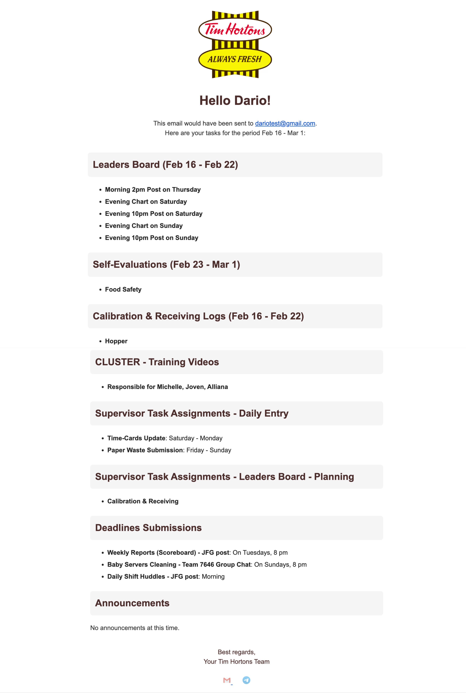
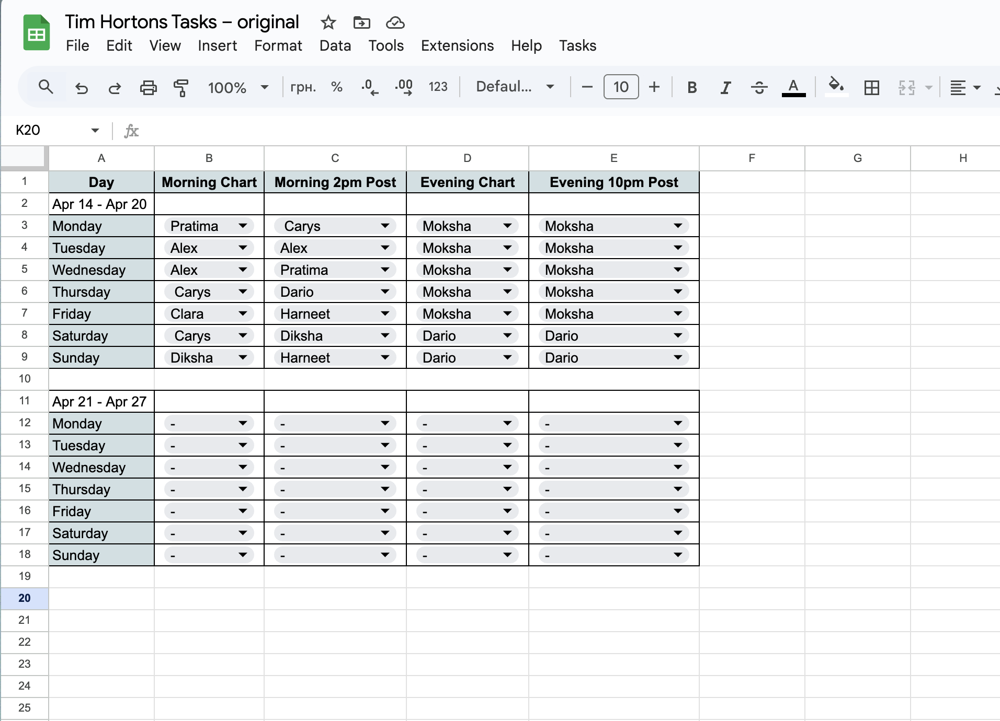
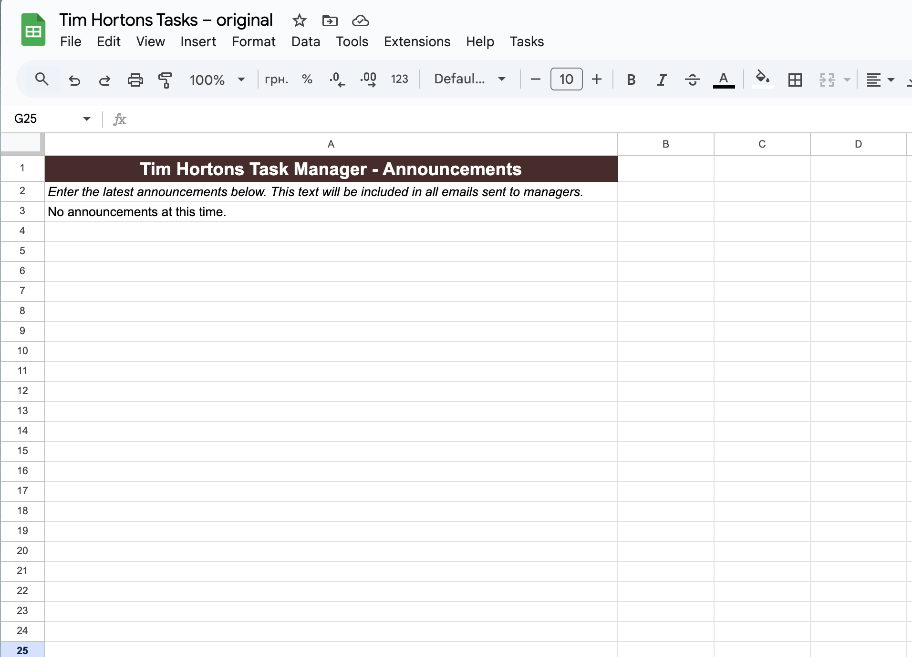

# Tim Hortons Weekly Task Automator

Google Apps Script tool that **automatically collects tasks** from multiple Google Sheets tabs and **sends personalized, beautifully formatted HTML emails** to restaurant managers every week.

**Real-world production tool** used at Tim Hortons — reduces weekly manual preparation from 3–6 hours to ~2–3 minutes, eliminates distribution errors, and provides managers with clean calendar-style task overviews.

### Sample Received Email (Full View)

## Key Features

- Aggregates tasks from 7+ sheets:
  - Leaders Board (shift planning with visual calendar)
  - Self-Evaluations
  - Calibration & Receiving Logs
  - Weekly Reports – Section Assignments
  - CLUSTER – Training Videos
  - Supervisor Task Assignments
  - Deadlines & Submissions
- Beautiful two-week Leaders Board table in emails (with checkmarks ✓)
- Global announcements included in every email
- Test mode — send all emails to one address for preview
- Skip any manager by setting email to "-"
- Full action logging in the "Logs" sheet
- Gmail quota check + automatic warning emails on issues
- Custom menu in Google Sheets: Preview & Send, Test Emails, View Logs, etc.

## Technologies

- Google Apps Script (JavaScript)
- Google Sheets as database
- GmailApp for sending emails
- HTML + inline CSS for email templates
- Spreadsheet UI (custom menu, dialogs, alerts)

## Screenshots

  
  

  
  

## Installation & Usage

1. Make a copy of your Tim Hortons task spreadsheet
2. Go to **Extensions → Apps Script**
3. Delete default code and paste your script (or copy files from `/src/`)
4. Save the project
5. Reload the spreadsheet — the **Tasks** menu will appear
6. Use **Tasks → Preview & Send Tasks** to review and send

Detailed setup guide → [INSTALL.md](docs/INSTALL.md) (create this file later if needed)

## Business Impact

- Weekly preparation time: reduced from ~4 hours → under 5 minutes
- Zero manual copy-paste errors in task assignment
- Managers receive clean, branded, easy-to-read emails instead of plain text or screenshots
- Full audit trail in Logs sheet

## Folder Structure (recommended)
